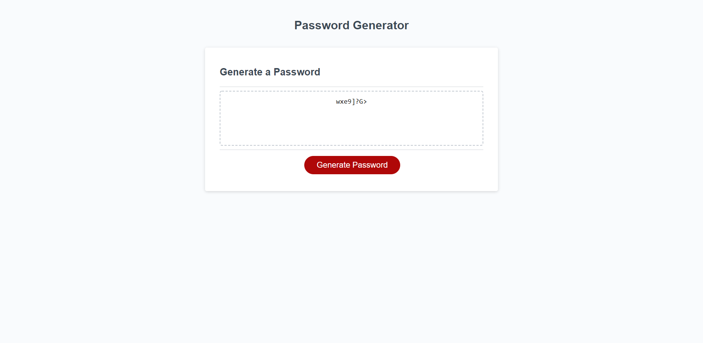

# PW_Generator_Nickpodski

## Description

  This is a random password generator that I created for a homework assignment for my coding bootcamp. When you click the generate button it prompts you to choose a password length, and then will ask you 4 questions for password criteria. The criteria is if you'd want lowercase letters, uppercase letters, numbers, and/or special characters. Then it displays the randomly generated password for you to use.

## Screenshots

## Links

https://nickpodski.github.io/PW_Generator_Nickpodski/ - Live URL
https://github.com/Nickpodski/PW_Generator_Nickpodski - GitHub Repo

## Credits

https://www.w3schools.com/ - W3 Schools
https://stackoverflow.com/ - Stack Overflow